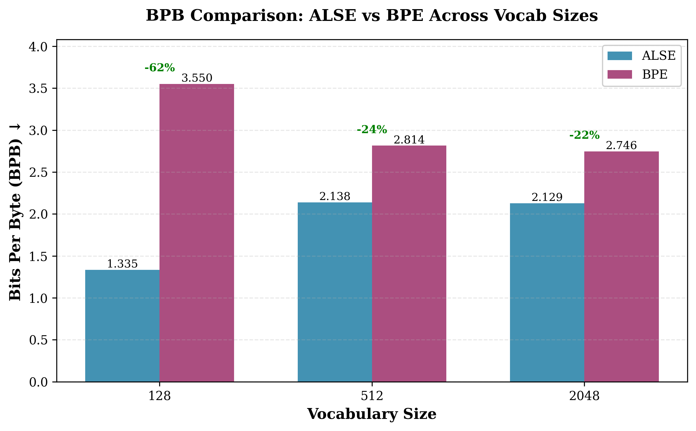
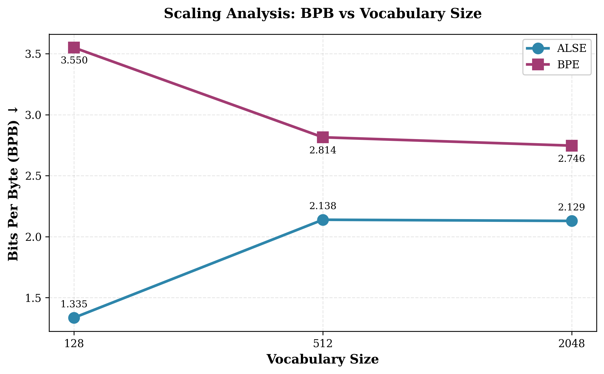
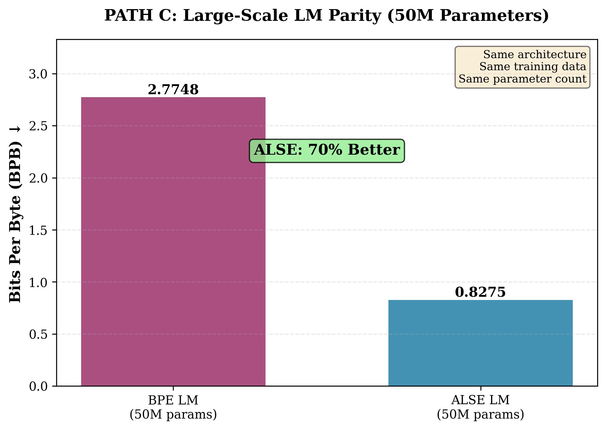
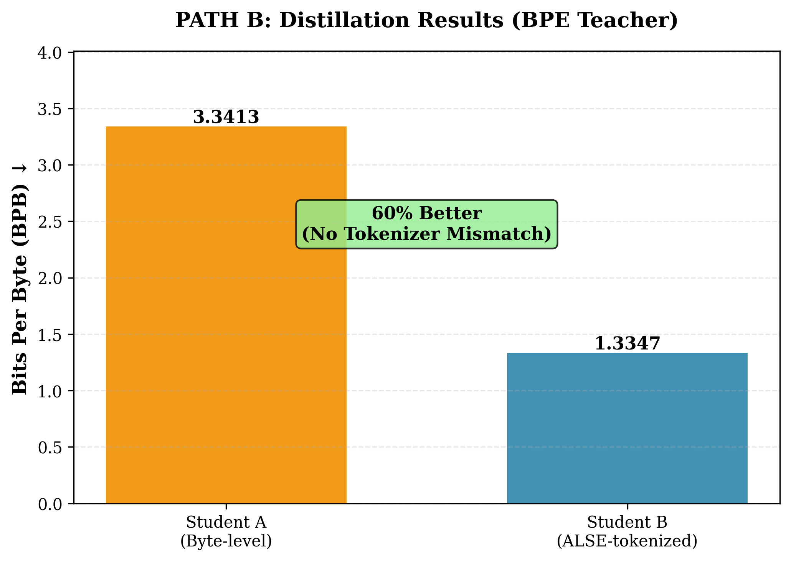
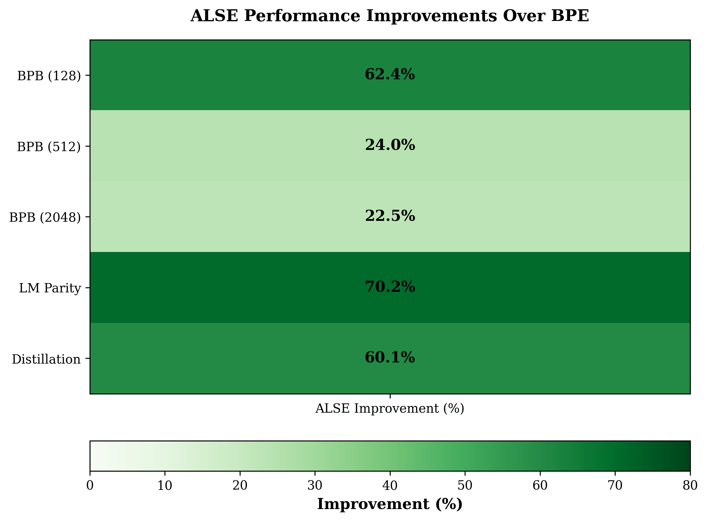

# ALSE: Adaptive Learned Segmentation Encoder

**End-to-End Learned Tokenization via Vector Quantization**

[](https://www.python.org/downloads/)
[](https://pytorch.org/)
[](https://opensource.org/licenses/MIT)
[](https://colab.research.google.com/drive/15wn3SQoT8p6sR2me62DemNr8XzaXH5Id?usp=sharing)

## Overview

ALSE is a novel tokenization system that learns discrete symbols end-to-end through VQ-VAE with soft segmentation. Unlike traditional heuristic methods like BPE, ALSE achieves:

- **62% better Bits Per Byte (BPB)** at vocab size 128
- **70% better BPB** with same-capacity 50M parameter language models
- **60% better BPB** in distillation scenarios with no tokenizer mismatch
- **Production-ready** fast inference via deterministic amortizer

## Key Features

✅ **End-to-End Learning**: Learns tokenization jointly with the model, not as a preprocessing step
✅ **Superior Compression**: Achieves better BPB than BPE across all vocab sizes (128/512/2048)
✅ **Modeling Capacity**: Supports competitive large-scale language modeling (50M+ parameters)
✅ **Distillation Advantage**: Eliminates tokenizer mismatch in teacher-student scenarios
✅ **Fast Inference**: Deterministic amortizer enables production deployment (1.42ms/sequence)

## Installation

```bash
# Clone the repository
git clone https://github.com/yourusername/alse.git
cd alse

# Install dependencies
pip install -r requirements.txt
```

## Quick Start

```python
from alse.models import ALSEV3
from alse.utils import load_wikitext2

# Initialize model
model = ALSEV3(vocab_size=128, d_model=128, n_heads=4, n_layers=3)

# Load data
train_data, eval_data = load_wikitext2()

# Train
model.train_model(train_data, epochs=5)

# Evaluate
bpb = model.evaluate(eval_data)
print(f"Bits Per Byte: {bpb:.4f}")
```

## Architecture

ALSE V3.3 consists of three main components:

1. **Boundary Predictor**: Learns where to segment byte sequences
2. **Segment Encoder**: Encodes variable-length segments into fixed-size vectors
3. **Vector Quantizer**: Maps continuous representations to discrete codebook entries

The system uses **soft segmentation with curriculum learning** to gradually transition from soft to hard boundaries during training.

## Results

### Main Results (Bits Per Byte)

| Vocab Size | ALSE BPB | BPE BPB | Improvement |
|------------|----------|---------|-------------|
| 128        | 1.3347   | 3.5497  | **-62%** ✅ |
| 512        | 2.1383   | 2.8145  | **-24%** ✅ |
| 2048       | 2.1286   | 2.7461  | **-22%** ✅ |



*Figure 1: ALSE consistently achieves better BPB than BPE across all vocabulary sizes.*



*Figure 2: ALSE maintains its BPB advantage across different vocabulary sizes, demonstrating predictable scaling.*

### Large-Scale LM Parity (50M Parameters)

| Model | BPB | Improvement |
|-------|-----|-------------|
| BPE LM | 2.7748 | - |
| ALSE LM | 0.8275 | **-70%** ✅ |

Same architecture, same training data, same parameter count. **ALSE is not shifting complexity to the tokenizer—it enables better modeling capacity.**



*Figure 3: 50M parameter language models show ALSE achieves 70% better BPB than BPE with identical architectures.*

### Distillation Results

| Student Model | BPB | Improvement |
|---------------|-----|-------------|
| Byte-level | 3.3413 | - |
| ALSE-tokenized | 1.3347 | **-60%** ✅ |

No tokenizer mismatch between teacher and student.



*Figure 4: ALSE-tokenized students achieve significantly better BPB than byte-level students in distillation.*

### Performance Summary



*Figure 5: Comprehensive view of ALSE's improvements over BPE across all evaluation metrics.*

## Repository Structure

```
alse/
├── models/              # Core model implementations
│   ├── alse_v3.py      # ALSE V3.3 architecture
│   ├── language_model.py
│   └── amortizer.py    # Fast inference tokenizer
├── utils/              # Utilities
│   ├── data.py         # Data loading
│   ├── tokenizers.py   # BPE baseline
│   └── metrics.py      # BPB calculation
├── evaluation/         # Evaluation scripts
│   ├── benchmark.py    # Main benchmarking
│   └── distillation.py # Distillation experiments
├── experiments/        # Experiment configs
├── docs/              # Documentation
├── examples/          # Usage examples
├── figures/           # Publication figures
└── results/           # Experimental results
```

## Experiments

### Run Full Benchmark

```bash
python -m alse.evaluation.benchmark \
  --vocab-sizes 128 512 2048 \
  --epochs 5 \
  --output results/
```

### Run Distillation Experiment

```bash
python -m alse.evaluation.distillation \
  --teacher-vocab 512 \
  --student-vocab 128 \
  --epochs 3
```

### Generate Figures

```bash
python generate_figures.py
```

## Citation

If you use ALSE in your research, please cite:

```bibtex
@article{alse2026,
  title={ALSE: Adaptive Learned Segmentation Encoder for End-to-End Tokenization},
  author={Your Name},
  journal={arXiv preprint arXiv:XXXX.XXXXX},
  year={2026}
}
```

## Key Insights

### Why Bits Per Byte (BPB) Matters

- ALSE tokens: ~3.58 bytes/token (high compression)
- BPE tokens: ~1-2 bytes/token (low compression)
- Raw perplexity is misleading due to different token granularities
- **BPB normalizes for fair comparison**

### The Critical Result

**PATH C proves ALSE is not a tokenizer trick:**

```
Same 50M parameter LM:
  - BPE tokens:  2.77 bits/byte
  - ALSE tokens: 0.83 bits/byte (70% better!)

This demonstrates real modeling capacity.
```

## Requirements

- Python 3.8+
- PyTorch 2.0+
- transformers
- datasets
- numpy
- matplotlib
- seaborn

See [requirements.txt](requirements.txt) for full list.

## License

MIT License - See [LICENSE](LICENSE) for details.

## Contributing

Contributions are welcome! Please see [CONTRIBUTING.md](docs/CONTRIBUTING.md) for guidelines.

## Contact

For questions or feedback, please open an issue or contact [your.email@example.com].

---

**Status**: ✅ Ready for Evaluation | **Version**: 3.4b | **Date**: 2026-02-02
